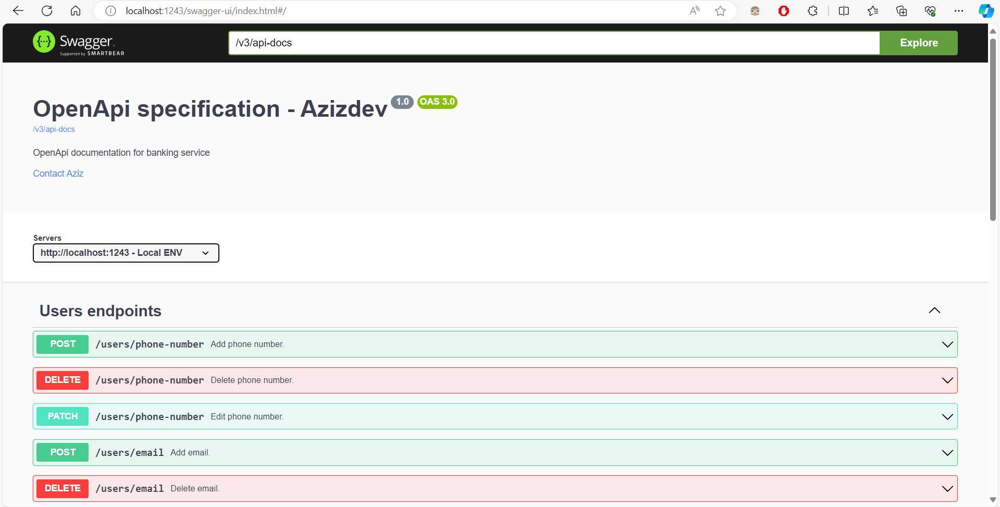
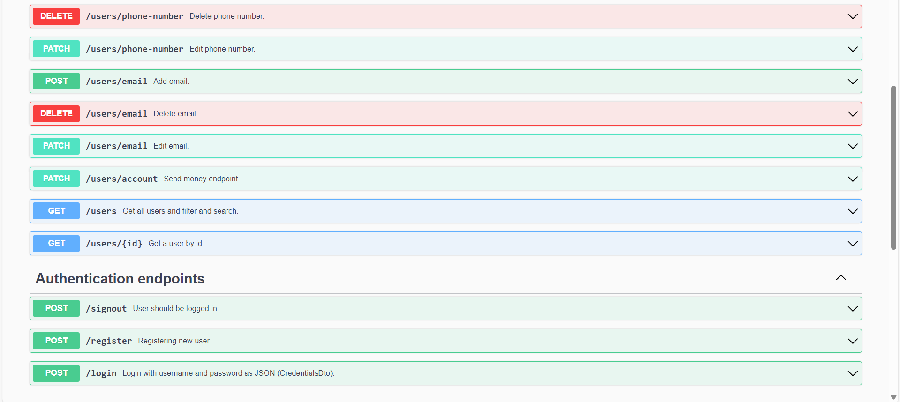

# Movies
The backend part of a banking service.
System has creation, editing, deleting and viewing users endpoints.

## Features
* All CRUD operations of users
* Searching users

## Technologies
* Spring Boot 3.0
* Spring Security with JWT
* Spring Validation
* Project Lombok
* Mapstruct
* Postgresql
* Spring doc (Swagger UI & Open API)
* Docker

## Getting Started
To get started with this project, you will need to have the following installed on your local machine:

* JDK 17+
* Maven 3+
* Docker

To build and run the project, follow these steps:

* Clone the repository: `git clone https://github.com/AzizDeveloper/banking`
* Build the project: mvn clean install
* Run the project: mvn spring-boot:run

-> The application will be available at http://localhost:1243

-> Swagger UI will be available at http://localhost:1243/swagger-ui/index.html
Screenshots of swagger-ui:

